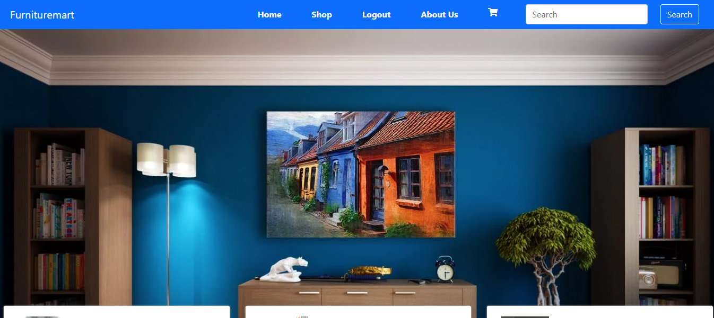

# Hi , My name is vimal kumar.

## I have created this fullstack web application named "Furnituremart".
It took me several months to complete it. 
### I have learnt following things while creating this project.
1. JavaScript
2. React Js
3. Node Js
4. MongoDB
5. Express Js

  ##### [Click here to view live project](www.google.com "click here to view page")